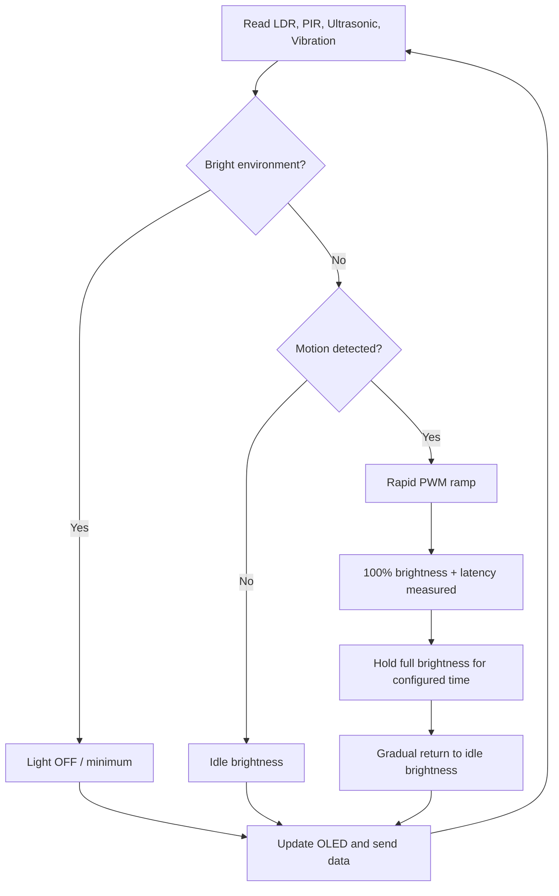
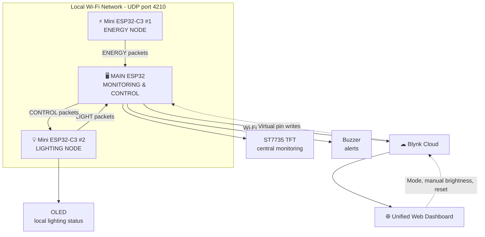
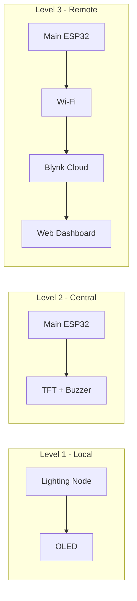
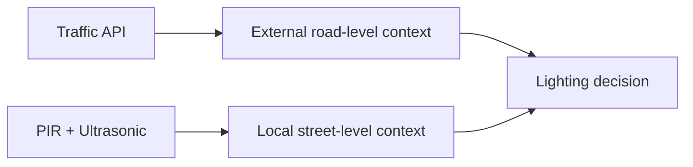

<div align="center">

# 💡 Smart Adaptive Street Lighting

### Occupancy & Footfall-Responsive Intelligent Lighting System


**Challenge:** `HTH-SA-06` &nbsp;|&nbsp; **Category:** Smart City / Municipal Energy

> **"Light only when needed. Respond instantly when it matters."**

**SENSE → DECIDE → RESPOND → MEASURE → OPTIMIZE**

</div>

---

## 📑 Table of Contents

- [Overview](#-overview)
- [Challenge](#-challenge)
- [Problem](#-problem)
- [Solution](#-solution)
- [Architecture](#-architecture)
- [Hardware](#-hardware)
- [Main ESP32](#-main-esp32)
- [Energy Node](#-energy-node)
- [Lighting Node](#-lighting-node)
- [Communication](#-communication)
- [Web Dashboard](#-web-dashboard)
- [Safety](#-safety)
- [Energy Measurement](#-energy-measurement)
- [ML / AI](#-ml--ai)
- [Weather](#-weather)
- [Traffic](#-traffic)
- [24-Hour Simulation](#-24-hour-simulation)
- [Results](#-results)
- [Installation](#-installation)
- [Configuration](#-configuration)
- [Testing](#-testing)
- [Calibration](#-calibration)
- [Troubleshooting](#-troubleshooting)
- [Repository Structure](#-repository-structure)
- [Future Scope](#-future-scope)
- [Challenge Alignment](#-challenge-alignment)
- [Team](#-team)
- [License](#-license)

---

## 🚀 Overview

**Smart Adaptive Street Lighting** is a distributed, IoT-based smart-city lighting **prototype**. It adjusts LED street-light brightness according to ambient light and pedestrian/vehicle activity, while measuring energy use and verifying that the light reaches full brightness quickly enough when someone approaches.

The system combines:

- Ambient-light sensing
- Motion detection
- Distance detection
- Vibration monitoring
- Adaptive (PWM) LED brightness
- Energy and battery monitoring
- Safety response-latency measurement
- Wi-Fi communication between nodes
- Central TFT monitoring and local OLED monitoring
- A unified web dashboard (Blynk)
- Weather and traffic context *(extension)*
- ML-based intelligence *(planned / under development)*

```text
SENSE  →  DECIDE  →  RESPOND  →  MEASURE  →  OPTIMIZE
```

### Implementation status legend

| Symbol | Meaning |
|---|---|
| ✅ | Implemented / part of the current prototype |
| 🔄 | Planned / extension / under development |

> **Honesty note:** Any value shown as `XX.X%`, `XX ms`, or `XX Wh` is a **placeholder**. Real numbers are reported only after they are measured (or produced by a documented simulation) and clearly labelled as such.

---

## 🎯 Challenge

| | |
|---|---|
| **Challenge ID** | HTH-SA-06 |
| **Category** | Smart City / Municipal Energy |
| **Objective** | Design and prototype an intelligent street-lighting system that dynamically adjusts illumination according to ambient light and pedestrian/vehicle activity, reduces unnecessary energy usage, and verifies safety response latency. |

---

## 💡 Problem

Conventional street lights typically run at fixed brightness for the whole night, including long periods when roads and footpaths are empty. This wastes energy and increases municipal operating cost. Simply dimming the lights is not enough, because a light that reacts too slowly can compromise pedestrian and vehicle safety.

The core challenge is therefore twofold:

1. **Reduce unnecessary illumination** when nobody is present.
2. **Guarantee a fast, measurable response** when activity is detected.

---

## 🧠 Solution

The prototype treats street lighting as a **closed loop**: sense the environment, decide on a brightness level, respond with PWM control, measure both energy and response time, then use the measurements to improve behaviour.

| Stage | What happens in this project |
|---|---|
| **Sense** | LDR (ambient light), PIR (motion), ultrasonic (distance), vibration sensor, voltage/current sensing |
| **Decide** | Deterministic day/night/motion rules today; ML-assisted recommendation planned |
| **Respond** | PWM LED ramp to full brightness; hold time; gradual return to idle brightness |
| **Measure** | Power, energy, battery, and motion-to-full-brightness latency |
| **Optimize** | Compare adaptive vs. always-ON baseline; tune thresholds; add context (weather, traffic, ML) |

### Feature checklist

**Implemented / current prototype**

- ✅ Adaptive brightness
- ✅ Ambient-light sensing
- ✅ Motion detection
- ✅ Distance detection
- ✅ Energy monitoring
- ✅ Battery monitoring
- ✅ Safety-latency measurement
- ✅ 24-hour traffic simulation
- ✅ Distributed ESP32 architecture
- ✅ Wi-Fi communication
- ✅ TFT central monitoring
- ✅ OLED local monitoring
- ✅ Unified web dashboard
- ✅ Manual / Auto control
- ✅ Buzzer alerts
- ✅ Piezo supplementary energy harvesting

**Planned / extension**

- 🔄 Weather API
- 🔄 Traffic API
- 🔄 ML prediction
- 🔄 Energy anomaly detection
- 🔄 Infrastructure anomaly detection

### Control logic

```text
START
  ↓
Read LDR
  ↓
Determine Day / Night
  ↓
If DAY:
    Light OFF (or minimum state)
Else:
    Read PIR
    Read Distance

    If MOTION:
        Ramp to 100%
        Measure latency
    Else:
        Maintain idle brightness
  ↓
Read Energy Data
  ↓
Read Vibration
  ↓
Update OLED
  ↓
Send Data to Main ESP32
  ↓
Send Data to Dashboard
  ↓
Repeat
```



**Operating modes**

| Condition | Behaviour |
|---|---|
| **Day** (high ambient light) | LED OFF or minimum state |
| **Night + no motion** | Low standby (idle) brightness |
| **Night + motion** | Rapid brightness increase to 100% |
| **Post-motion** | Hold full brightness for a configured time, then gradually return to idle brightness |

The hold time, ramp behaviour, and brightness step values are **configurable prototype parameters**, not fixed real-world standards.

---

## 🧩 Architecture

The system uses **three ESP32-based nodes** on the same Wi-Fi network:

| Node | Board | Role |
|---|---|---|
| **Node 1 – Energy Node** | Mini ESP32-C3 #1 | Energy harvesting experiment, electrical measurement, battery monitoring, energy data transmission |
| **Node 2 – Lighting Node** | Mini ESP32-C3 #2 | Sensing and adaptive LED control |
| **Node 3 – Monitoring & Control Node** | Main ESP32 | Central controller, TFT UI, buzzer, communication gateway, Blynk gateway |

### System data flow



### Three-level monitoring



| Level | Display | Purpose |
|---|---|---|
| **OLED** | Lighting Node | Local Lighting Node status |
| **TFT** | Main ESP32 | Central prototype monitoring |
| **Blynk** | Web dashboard | Remote unified monitoring and control |

---

## 🔌 Hardware

### Bill of Materials

Quantities are marked `TBD` where they are not yet confirmed.

| Component | Quantity | Purpose | Node |
|---|---|---|---|
| Main ESP32 | 1 | Central controller and gateway | Main |
| Mini ESP32-C3 | 2 | Energy Node and Lighting Node controllers | Energy / Lighting |
| ST7735 TFT display | 1 | Central monitoring UI | Main |
| OLED display (SSD1306-class) | 1 | Local lighting status | Lighting |
| PIR sensor | 1 | Motion detection | Lighting |
| LDR | 1 | Ambient-light sensing | Lighting |
| Ultrasonic sensor (HC-SR04-class) | 1 | Distance / approach detection | Lighting |
| Vibration sensor | 1 | Physical disturbance / infrastructure monitoring | Lighting |
| Potentiometer | 1 | Manual idle-brightness adjustment | Lighting |
| LED(s) | 3 | Street-light prototype output | Lighting |
| Current sensor | 1 | Current measurement (series) | Energy |
| Voltage sensor | 1 | Voltage measurement (parallel) | Energy |
| Piezoelectric disk | 1 | Supplementary micro-energy harvesting experiment | Energy |
| Li-ion battery | 1 | Energy storage | Energy |
| Charging module | 1 | Safe Li-ion charging | Energy |
| Boost converter | 1 | Voltage step-up | Energy |
| Buck converter | 1 | Voltage step-down | Energy |
| DC-DC multi-power module | 1 | Power regulation | Energy |
| Single-channel relay | 1 | Load / power-path switching (role to be confirmed) | Energy / Lighting |
| Push buttons | 4+ (Main), 1 (Lighting) | Navigation, mode control, brightness step | Main / Lighting |
| Buzzer | 2 | Alerts | Main |
| Capacitor(s) | 1 | Energy buffering | Energy |
| Fuse | 1 | Overcurrent protection | Energy |
| Breadboard | 1 | Prototyping | All |
| Wires / supporting components | - | Interconnects, resistors, transistor/MOSFET driver, level shifting | All |

### Software stack

**Used in the current prototype**

| Layer | Technology |
|---|---|
| IDE | Arduino IDE |
| Language | C / C++ |
| Core | ESP32 Arduino core |
| Networking | Wi-Fi, UDP |
| Display libraries | Adafruit GFX, Adafruit ST7735, Adafruit SSD1306 |
| Dashboard | Blynk |

**Potential future components** *(not part of the current implementation)*

| Area | Technology |
|---|---|
| ML training | Python, scikit-learn |
| Embedded inference | TensorFlow Lite Micro or another suitable embedded ML framework |
| Context data | Weather API, Traffic API |
| Aggregation | Backend service |

---

## 📺 Main ESP32

**Purpose:** central controller, user interface, communication gateway, and Blynk gateway.

**Hardware:** Main ESP32, ST7735 TFT display, 4+ push buttons, buzzer, Wi-Fi.

### Current prototype pin assignment

| Function | GPIO |
|---|---|
| TFT CS | 15 |
| TFT DC | 2 |
| TFT RST | 4 |
| TFT SCLK | 18 |
| TFT MOSI | 23 |
| Button 1 (B1) | 12 |
| Button 2 (B2) | 13 |
| Button 3 (B3) | 14 |
| Button 4 (B4) | 26 |
| Buzzer | 27 |

> These pins are already allocated and should be treated as **RESERVED** on the Main ESP32. Verify against your exact ESP32 board before final assembly. Some of these GPIOs (for example 2, 12, 15) are boot-strapping pins on many ESP32 modules; see [Troubleshooting](#-troubleshooting).

### Button functions

| Button | Function |
|---|---|
| **B1** | Overview page |
| **B2** | Energy page |
| **B3** | Lighting page |
| **B4** | AUTO / MANUAL mode toggle |

### TFT pages

| Page | Content |
|---|---|
| **1 – Overview** | Combined system summary |
| **2 – Energy** | Voltage, current, power, energy, battery |
| **3 – Lighting** | Ambient light, motion, distance, brightness, vibration, latency |
| **4 – System** | Node connectivity, mode, Wi-Fi/RSSI, alerts (shown per firmware navigation) |

### Buzzer alerts

The buzzer is used for notifications such as:

- Motion event
- Node offline
- Safety status
- Low battery
- System fault

---

## ⚡ Energy Node

**Board:** Mini ESP32-C3 #1
**Purpose:** energy harvesting experiment, electrical measurement, battery monitoring, and energy data transmission.

### Hardware

Mini ESP32-C3, piezoelectric disk, capacitor, charging module, Li-ion battery, current sensor, voltage sensor, boost converter, buck converter, DC-DC power module, fuse, and supporting components.

### Conceptual energy path


> ⚠️ The piezoelectric subsystem is a **supplementary micro-energy harvesting experiment**. It is **not** claimed to power the complete street-light load. Its contribution is measured, not assumed.

### Measurement principle

| Quantity | Connection | Note |
|---|---|---|
| **Voltage** | **Parallel** (across the measurement point) | Voltage sensor connected across the point being measured |
| **Current** | **Series** (in the measured power path) | Current sensor inserted in series with the load/source path |

The exact sensor wiring and calibration depend on the actual current-sensor and voltage-sensor models used.

### Current prototype pin assignment (ESP32-C3 ADC)

| Function | GPIO |
|---|---|
| Current sensor OUT | 3 |
| Voltage sensor OUT | 4 |

> These are project-assigned pins. Verify them against the exact sensor boards and ESP32-C3 board variant. The ADC input must never exceed the ESP32-C3 input limit; scale down with a proper divider if the sensor module can output higher voltages.

### Power and energy

```text
P = V × I                      (instantaneous power)

E = ∫ P(t) dt                  (continuous form)

E_Wh += P × Δt_hours           (discrete accumulation in firmware)
```

### Battery model

| Mode | Description |
|---|---|
| **Sensor mode** | Battery percentage is estimated from measured battery voltage. This is an **approximate** voltage-based Li-ion estimate. |
| **Simulation mode** | Battery level changes according to modelled system consumption and/or charging events. Values are labelled **simulated** and are never called "measured". |

A dedicated **fuel-gauge IC** can be added later for improved accuracy.

---

## 💡 Lighting Node

**Board:** Mini ESP32-C3 #2
**Purpose:** intelligent adaptive lighting.

### Sensors and outputs

| Type | Component | Purpose |
|---|---|---|
| Input | LDR | Ambient-light detection |
| Input | PIR | Motion detection |
| Input | Ultrasonic | Distance / approach detection |
| Input | Vibration sensor | Physical disturbance and infrastructure monitoring |
| Input | Potentiometer | Manual idle/standby brightness adjustment |
| Input | Button | Optional local brightness step |
| Output | LED (PWM) | Street-light prototype |
| Output | OLED | Local status |

### Current prototype pin assignment

| Function | GPIO |
|---|---|
| LDR | 0 |
| Potentiometer | 1 |
| LED PWM | 3 |
| Vibration sensor | 4 |
| PIR | 5 |
| Ultrasonic TRIG | 6 |
| Ultrasonic ECHO | 7 |
| OLED SDA | 8 |
| OLED SCL | 9 |
| Brightness adjust button | 10 |

> **Important**
> - Exact GPIO availability depends on the exact ESP32-C3 board variant. **Verify the pin mapping before final assembly.**
> - **Do not feed 5 V logic directly into an ESP32-C3 GPIO.**
> - HC-SR04-class ECHO outputs may require a level shifter or resistor divider.
> - High-power LEDs must **not** be driven directly from a GPIO. Use a proper transistor/MOSFET/driver.
> - Sensor supply voltages must match each module's specification.

### Brightness control

- **PWM** controls LED brightness.
- The **potentiometer** sets the idle/standby brightness. Example range: **20–60%** (configurable).
- The optional **local button** cycles through preset levels, for example `20 → 40 → 60 → 80 → 100 → repeat`.

> The step values above are **configurable examples**, not real-world standards.

### Vibration / infrastructure monitoring

The vibration sensor is **not** the main occupancy sensor. Its purpose is to:

- Detect physical disturbance
- Detect unusual vibration patterns
- Support infrastructure anomaly detection

A potential future ML function is classifying **normal vibration vs. abnormal vibration** after a baseline has been established.

---

## 📡 Communication

Nodes communicate over Wi-Fi using **UDP on port `4210`**.

| Direction | Data |
|---|---|
| Energy Node → Main ESP32 | `ENERGY` packets |
| Lighting Node → Main ESP32 | `LIGHT` packets |
| Main ESP32 → Lighting Node | `CONTROL` packets |
| Main ESP32 → Blynk Cloud | Unified data (all nodes) |

### `ENERGY` packet

```text
ENERGY,Voltage,Current,Power,Energy,Battery,RSSI
```

| Field | Meaning | Unit |
|---|---|---|
| Voltage | Measured voltage | V |
| Current | Measured current | A |
| Power | Calculated power (V × I) | W |
| Energy | Accumulated energy consumed | Wh |
| Battery | Battery level (sensor-estimated or simulated) | % |
| RSSI | Wi-Fi signal strength of the node | dBm |

Example (illustrative format only):

```text
ENERGY,3.870,0.120,0.464,0.003421,82.0,-48
```

### `LIGHT` packet

```text
LIGHT,Ambient,Motion,Distance,Brightness,Vibration,Latency,Saving,RSSI
```

| Field | Meaning | Unit / values |
|---|---|---|
| Ambient | Ambient-light level | % |
| Motion | PIR state | `0` = none, `1` = detected |
| Distance | Ultrasonic distance | cm |
| Brightness | Current LED brightness | % |
| Vibration | Vibration state | `0` = normal, `1` = detected |
| Latency | Motion-detected → full-brightness time | ms |
| Saving | Energy saving vs. baseline | % |
| RSSI | Wi-Fi signal strength of the node | dBm |

Example (illustrative format only):

```text
LIGHT,18,1,320.5,100,0,125,0.0,-51
```

### `CONTROL` packet

```text
CONTROL,Mode,Brightness
```

| Field | Meaning |
|---|---|
| Mode | `AUTO` or `MANUAL` |
| Brightness | Manual brightness in % (used in `MANUAL`; not used in `AUTO`) |

```text
CONTROL,AUTO,0
CONTROL,MANUAL,50
```

> Packet examples are format demonstrations, **not measured results**. No credentials are ever transmitted or documented in packets.

---

## 🌐 Web Dashboard

The project uses **one unified Blynk dashboard** instead of three separate ones. The Main ESP32 is the gateway that pushes all node data to Blynk.

### Dashboard sections

System Status · Energy Node · Lighting Node · Brightness / Energy Graphs · Safety · Energy Saving · AI / ML Insights · Weather · Traffic · Controls

### Virtual pin map

**Core pins (current prototype)**

| Pin | Data |
|---|---|
| V0 | Battery Voltage |
| V1 | Current |
| V2 | Power |
| V3 | Battery |
| V4 | Energy Consumed |
| V5 | Ambient Light |
| V6 | Motion |
| V7 | Distance |
| V8 | Brightness |
| V9 | Vibration |
| V10 | Safety Latency |
| V11 | Energy Saving |

**Extended pins (planned / extension)**

| Pin | Data | Group |
|---|---|---|
| V12 | Temperature | Weather |
| V13 | Humidity | Weather |
| V14 | Rain Status | Weather |
| V15 | Visibility | Weather |
| V16 | Traffic Level | Traffic |
| V17 | Traffic Speed | Traffic |
| V18 | Traffic Status | Traffic |
| V19 | Traffic State | ML |
| V20 | ML Confidence | ML |
| V21 | Recommended Brightness | ML |
| V22 | Energy Anomaly | ML |
| V23 | Vibration Anomaly | ML |
| V24 | Main Node Status | System |
| V25 | Energy Node Status | System |
| V26 | Lighting Node Status | System |
| V27 | Operating Mode | System |
| V28 | Manual Brightness | Control |
| V29 | Auto / Manual Control | Control |
| V30 | Reset Energy | Control |

### Dashboard mockup (illustrative layout)

```text
┌──────────────────────────────────────────────────────────────────────┐
│            💡 SMART ADAPTIVE STREET LIGHTING  |  HTH-SA-06           │
├───────────────────────────────┬──────────────────────────────────────┤
│  SYSTEM STATUS                │  CONTROLS                            │
│  Main [ONLINE]  Energy [ ]    │  Mode: [ AUTO | MANUAL ]             │
│  Lighting [ ]   Mode: AUTO    │  Manual Brightness: [====----] XX%   │
│                               │  [ Reset Energy ]                    │
├───────────────────────────────┼──────────────────────────────────────┤
│  ⚡ ENERGY NODE               │  💡 LIGHTING NODE                    │
│  Voltage      XX.XX V         │  Ambient     XX %                    │
│  Current      X.XXX A         │  Motion      DETECTED / NONE         │
│  Power        X.XXX W         │  Distance    XXX.X cm                │
│  Energy       X.XXXX Wh       │  Brightness  XX %                    │
│  Battery      XX %            │  Vibration   NORMAL / DETECTED       │
├───────────────────────────────┴──────────────────────────────────────┤
│  📈 BRIGHTNESS / POWER / ENERGY GRAPHS (Adaptive vs Baseline)        │
│  ▁▂▃▅▇█▇▅▃▂▁▁▂▅█████▅▂▁                                               │
├───────────────────────────────┬──────────────────────────────────────┤
│  🛡 SAFETY                    │  💰 ENERGY SAVING                    │
│  Latency: XX ms               │  Saving: XX.X %                      │
│  Bound:   XX ms  [PASS/FAIL]  │  (Measured during final testing)     │
├───────────────────────────────┼──────────────────────────────────────┤
│  🤖 AI / ML  (planned)        │  ☔ WEATHER (extension)               │
│  State: —   Confidence: —     │  Temp / Humidity / Rain / Visibility │
│  Recommended Brightness: —    │                                      │
├───────────────────────────────┴──────────────────────────────────────┤
│  🚗 TRAFFIC (extension): Level / Speed / Status                      │
└──────────────────────────────────────────────────────────────────────┘
```

---

## 🚨 Safety

### Safety response latency

When the PIR detects movement, the system measures how long it takes to reach full brightness:

```text
Motion Detected → Controller processing → PWM brightness ramp → 100% brightness → Latency measurement
```

```text
T_response = T_full_brightness − T_motion_detected
```

The measured response must be compared against a **predefined safety threshold**.

| Item | Value |
|---|---|
| Measured Response | `XX ms` *(Measured during final testing)* |
| Safety Bound | `XX ms` *(Placeholder: define before testing)* |
| Result | `PASS / FAIL` |

> No real result is claimed until actual testing has produced it. Note what the timestamps cover: firmware detection and PWM ramp time are measured. The PIR module's internal sensing delay and the LED's optical response are outside this software timestamp unless separately characterized.

### Electrical and hardware safety notes

- **Li-ion handling:** use appropriate charging circuitry, verify polarity, avoid short circuits, and never over-discharge or overcharge cells.
- **Protection:** use a fuse in the battery/power path.
- **Regulators:** confirm converter output voltage with a multimeter **before** connecting any ESP32.
- **GPIO/ADC limits:** never feed over-voltage into ESP32 GPIO or ADC pins.
- **5 V signals:** level-shift or divide 5 V ultrasonic ECHO signals.
- **LED driver:** use a transistor/MOSFET/driver stage for LEDs; never power them straight from a GPIO.
- **Piezo:** do not connect a piezo disk directly to a GPIO; use rectification/protection and conditioning.
- **Bring-up order:** test the power section on its own before connecting the ESP32 boards.

---

## 📊 Energy Measurement

```text
Instantaneous power:    P = V × I

Accumulated energy:     E = Σ (P × Δt_hours)

Energy Saving % = ((E_baseline − E_adaptive) / E_baseline) × 100
```

| Term | Definition |
|---|---|
| **Baseline** | Always-ON or fixed-brightness reference system |
| **Adaptive** | Dynamic-brightness system |

Final energy-saving figures must be based on **actual measured electrical data** or **documented simulation results**. No saving percentage is claimed in this README until such data exists.

---

## 🤖 ML / AI

> **Status: Planned / under development.** The current prototype uses deterministic, rule-based threshold logic. Rule-based thresholds are **not** described as machine learning.

### Intended inputs

Ambient light · PIR motion · Distance · Time of day · Traffic history · Traffic API information · Weather · Brightness · Power consumption · Vibration

### Intended outputs

| Output | Examples |
|---|---|
| Traffic / activity state | `IDLE`, `LOW TRAFFIC`, `ACTIVE`, `HIGH TRAFFIC` |
| Recommended brightness | `20%`, `30%`, `50%`, `75%`, `100%` |
| Energy anomaly | Unusual power/energy behaviour |
| Vibration / infrastructure anomaly | Normal vs. abnormal vibration |

### Development path


### Planned control architecture

```text
Sensor Data
   +
Weather
   +
Traffic
   +
Time
   ↓
ML Model
   ↓
Traffic / Activity Prediction
   ↓
Recommended Brightness
   ↓
Adaptive Lighting Controller
```

The deterministic rule-based controller stays as the safe fallback while the ML model is developed and validated.

---

## ☔ Weather

> **Status: Future / extended functionality.**

**Possible data:** temperature, humidity, rain, visibility, weather condition.

**Purpose:** use environmental context to adapt lighting when visibility is reduced.

| Context | Possible response |
|---|---|
| Clear + low traffic | Lower standby illumination |
| Rain / reduced visibility | Higher baseline illumination |

The Weather API is a **contextual input** and **does not replace local sensors**. API keys are never hard-coded or published; see [Configuration](#-configuration).

---

## 🚗 Traffic

> **Status: Future / extended functionality.** Live traffic integration is not claimed to be complete.

**Possible data:** traffic level, vehicle speed, congestion state, traffic incidents.



| Source | Scope |
|---|---|
| **Traffic API** | Broad, external, road-level context |
| **PIR + Ultrasonic** | Local, immediate, street-segment context |

---

## 🧪 24-Hour Simulation

The MVP can use **simulated sensor streams with documented generation logic** to represent a full day.

### Example scenario timeline (configurable)

```text
00:00 ──── 04:00 ──── 08:00 ──── 12:00 ──── 16:00 ──── 20:00 ──── 24:00
```

| Time window | Condition |
|---|---|
| 00:00 – 04:00 | Night, low traffic |
| 04:00 – 08:00 | Transition to morning activity |
| 08:00 – 16:00 | Daytime, high ambient light |
| 16:00 – 20:00 | Evening peak |
| 20:00 – 24:00 | Late-night, variable activity |

### Scenarios

| Scenario | Characteristics |
|---|---|
| **Low traffic** | Few motion events, longer low-brightness periods, higher potential energy savings |
| **High traffic** | Frequent motion events, more full-brightness events, greater lighting demand |

Simulation values must be labelled **"Simulation value"** and are never presented as physical measurements.

---

## 📈 Results

> ⚠️ **All values below are placeholders.** Replace them with actual measurements or documented simulation results before publishing.

| Metric | Baseline | Adaptive | Result |
|---|---|---|---|
| Energy Consumption | `XX Wh` | `XX Wh` | `XX.X%` saving |
| Peak Brightness | `XX%` | `XX%` | — |
| Ramp-up Latency | — | `XX ms` | `PASS / FAIL` |
| Motion Response | — | `XX ms` | `PASS / FAIL` |
| Battery Change | `XX%` | `XX%` | — |

Label every value as one of: **Measured during final testing** · **Simulation value** · **Placeholder**.

### Screenshots and media

```markdown


```

*(Add your images to these paths, then paste the lines above into this section.)*

### 🎥 Demo

[Watch the project demonstration](VIDEO_LINK)

---

## 🧰 Installation

1. **Install Arduino IDE** (2.x recommended).
2. **Install ESP32 board support:** *Boards Manager → search "esp32" → install "esp32 by Espressif Systems".*
3. **Install required libraries** (Library Manager):
   - `Adafruit GFX Library`
   - `Adafruit ST7735 and ST7789 Library`
   - `Adafruit SSD1306`
   - `Blynk`
4. **Clone the repository**
```bash
   git clone https://github.com/<your-username>/HTH-SA-06-smart-adaptive-street-lighting.git
   cd HTH-SA-06-smart-adaptive-street-lighting
```
5. **Configure Wi-Fi and Blynk** (see [Configuration](#-configuration)).
6. **Upload firmware** to each board:

   | Sketch | Board to select |
   |---|---|
   | `firmware/main_esp32/main_esp32.ino` | ESP32 Dev Module (or your exact board) |
   | `firmware/energy_node_c3/energy_node_c3.ino` | ESP32C3 Dev Module (or your exact board) |
   | `firmware/lighting_node_c3/lighting_node_c3.ino` | ESP32C3 Dev Module (or your exact board) |

7. **Verify Serial Monitor** on each node (baud rate as set in the sketch): confirm boot, Wi-Fi connection, and sensor readings. On some ESP32-C3 boards, enable *USB CDC On Boot* to see Serial output.
8. **Verify Wi-Fi communication:** confirm the Main ESP32 prints incoming `ENERGY` and `LIGHT` packets on UDP port `4210`.
9. **Verify the Blynk dashboard:** confirm live values on the core virtual pins V0–V11.
10. **Run the safety-latency test** (see [Testing](#-testing), Test 4).
11. **Run the low / high traffic simulation** (see [24-Hour Simulation](#-24-hour-simulation)).
12. **Record final energy measurements** in the [Results](#-results) table.

---

## 🔑 Configuration

### 🔒 Security first

**Never commit** Wi-Fi passwords, Blynk auth tokens, API keys, or any private credentials. Keep secrets **outside the repository** (in an ignored file or environment variables) and commit only placeholder templates.

> If any real credential was ever pasted into a commit, chat, or screenshot, treat it as compromised: change the Wi-Fi password and regenerate the Blynk token/API keys.

### Wi-Fi

```cpp
const char* WIFI_SSID     = "YOUR_WIFI_NAME";
const char* WIFI_PASSWORD = "YOUR_WIFI_PASSWORD";
```

### Blynk

```cpp
#define BLYNK_TEMPLATE_ID   "YOUR_TEMPLATE_ID"
#define BLYNK_TEMPLATE_NAME "Smart Adaptive Street Lighting"
#define BLYNK_AUTH_TOKEN    "YOUR_BLYNK_AUTH_TOKEN"
```

> `#define BLYNK_*` lines must appear **before** including the Blynk header.

### Recommended secrets workflow

Keep real values in a local `secrets.h` (ignored by Git) and commit only `secrets.example.h`.

```cpp
// secrets.example.h  (safe to commit - placeholders only)
#pragma once

const char* WIFI_SSID     = "YOUR_WIFI_NAME";
const char* WIFI_PASSWORD = "YOUR_WIFI_PASSWORD";

#define BLYNK_TEMPLATE_ID   "YOUR_TEMPLATE_ID"
#define BLYNK_TEMPLATE_NAME "Smart Adaptive Street Lighting"
#define BLYNK_AUTH_TOKEN    "YOUR_BLYNK_AUTH_TOKEN"
```

Copy it to `secrets.h`, fill in your real values, and include `secrets.h` in your sketch.

### Environment variables for backend / ML / API scripts

```bash
# .env  (NEVER commit - add to .gitignore)
WIFI_SSID=YOUR_WIFI_NAME
WIFI_PASSWORD=YOUR_WIFI_PASSWORD
BLYNK_AUTH_TOKEN=YOUR_BLYNK_AUTH_TOKEN
WEATHER_API_KEY=YOUR_WEATHER_API_KEY
TRAFFIC_API_KEY=YOUR_TRAFFIC_API_KEY
```

### `.gitignore` essentials

```gitignore
secrets.h
.env
*.env
```

### Tunable parameters

These are configurable and must be calibrated for your hardware. Values are not fixed standards.

| Parameter | Description |
|---|---|
| LDR day/night threshold | Ambient level that separates day from night |
| PIR hold time | How long full brightness is held after motion |
| Ramp behaviour | PWM ramp speed up and gradual return down |
| Idle brightness range | Potentiometer mapping (example range: 20–60%) |
| Brightness steps | Local button presets (example: 20/40/60/80/100) |
| Safety latency bound | Threshold for the PASS/FAIL comparison |
| Node-offline timeout | Time without packets before a node is flagged offline |

---

## ✅ Testing

| # | Test | Expected result |
|---|---|---|
| 1 | **Daylight detection** | Lighting OFF / minimum |
| 2 | **Night idle** | Low (idle) brightness |
| 3 | **Motion detection** | Rapid increase to full brightness |
| 4 | **Safety latency** | Measure motion detection → 100% brightness; compare to safety bound |
| 5 | **No-motion timeout** | Returns to idle brightness after hold time |
| 6 | **Energy comparison** | Always-ON vs. adaptive energy compared from measured data |
| 7 | **Node communication** | All three nodes exchange packets |
| 8 | **Dashboard** | Live values update on Blynk |
| 9 | **Battery** | Sensor mode and simulation mode both behave and are labelled correctly |
| 10 | **Vibration** | Normal and disturbance states are distinguished |
| 11 | **Weather API** *(extension)* | Contextual data received and displayed |
| 12 | **Traffic API** *(extension)* | Contextual data received and displayed |
| 13 | **ML** *(planned)* | Predictions evaluated against labelled test data |

Record outcomes as **Measured during final testing**, **Simulation value**, or **Placeholder**.

---

## 🔧 Calibration

| Sensor | Calibration approach |
|---|---|
| **Voltage sensor** | Compare readings against a trusted multimeter / reference and apply a correction factor. |
| **Current sensor** | Perform a zero-current offset calibration, then apply the sensitivity specific to the exact sensor model. |
| **LDR** | Measure bright and dark conditions and set the day/night threshold between them. |
| **PIR** | Tune trigger sensitivity and timeout settings; allow warm-up time after power-on. |
| **Ultrasonic** | Fix the mounting position and verify distances against a tape measure. |
| **Vibration** | Record a normal baseline before defining any anomaly threshold. |
| **Potentiometer** | Map the ADC range to the chosen idle-brightness range (for example 20–60%). |
| **Battery** | Voltage-to-percentage is approximate for Li-ion; calibrate it for your cell or replace it with a fuel-gauge IC. |

---

## 🐛 Troubleshooting

| Problem | Possible cause | Solution |
|---|---|---|
| **ESP32 does not boot** | Strapping pin held high/low at boot by a button, TFT, or sensor; insufficient power | Disconnect peripherals on strapping pins (e.g. GPIO 2, 12, 15 on ESP32; GPIO 8, 9 on ESP32-C3) and retry; use a stable power supply |
| **No Serial output (ESP32-C3)** | USB CDC not enabled | Enable *USB CDC On Boot* in the Arduino board menu |
| **OLED blank** | Wrong I2C address, SDA/SCL swapped, no power | Run an I2C scanner; check wiring and address (commonly `0x3C`) |
| **TFT blank** | Wrong pin definitions, wrong ST7735 variant/init, no backlight power | Recheck CS/DC/RST/SCLK/MOSI; select the correct tab/init for your panel |
| **PIR not detecting** | Warm-up not finished, wrong supply voltage, sensitivity too low | Wait for warm-up; check supply; adjust sensitivity/timeout |
| **LDR inverted** | Divider orientation (LDR to VCC vs. GND) | Swap the divider or invert the mapping in code |
| **Ultrasonic reads 999** | No echo (timeout), ECHO not connected, level-shifter fault | Check TRIG/ECHO wiring, supply, and the ECHO divider; verify the timeout logic |
| **Current reading incorrect** | Wrong zero offset, wrong sensitivity, sensor not in series | Recalibrate zero-current offset; verify sensor model and series placement |
| **Voltage reading incorrect** | Divider ratio mismatch, ADC attenuation, missing calibration | Compare with a multimeter; correct the ratio/attenuation |
| **Battery percentage incorrect** | Approximate voltage-to-% curve, load-induced voltage sag | Calibrate the curve; measure at rest; consider a fuel-gauge IC |
| **Wi-Fi connection fails** | Wrong credentials, 5 GHz-only network, weak signal | Use a 2.4 GHz network; check credentials and RSSI |
| **UDP packets not received** | Different subnets, wrong IP/port, firewall/AP client isolation | Use the same network, confirm port `4210` and target IP, disable client isolation |
| **Blynk data not updating** | Wrong template ID/token, no internet, wrong virtual pin | Verify credentials and datastreams; check internet access on the Main ESP32 |
| **Node appears offline** | Node powered down, Wi-Fi drop, timeout too short | Check power and RSSI; adjust the offline timeout |
| **LED does not dim** | Pin is not PWM-capable/configured, driver stage not suited to PWM, relay used for dimming | Configure PWM correctly; use a MOSFET/transistor driver; do not dim through a relay |
| **LED remains at 100%** | Manual mode active, PIR stuck triggered, hold time too long, driver wired always-on | Check mode; test PIR output; review hold-time and driver wiring |
| **Buzzer not working** | Active vs. passive buzzer mismatch, wrong pin, insufficient drive | Use `tone()` for passive and digital on/off for active; check polarity and GPIO 27 |

---

## 📁 Repository Structure

```text
smart-adaptive-street-lighting/
│
├── README.md
│
├── firmware/
│   ├── main_esp32/
│   │   └── main_esp32.ino
│   ├── energy_node_c3/
│   │   └── energy_node_c3.ino
│   └── lighting_node_c3/
│       └── lighting_node_c3.ino
│
├── dashboard/
│   ├── blynk/
│   │   ├── datastreams.md
│   │   └── dashboard_setup.md
│   └── screenshots/
│
├── hardware/
│   ├── pinout/
│   ├── wiring/
│   ├── schematics/
│   ├── pcb/
│   └── photos/
│
├── simulation/
│   ├── low_traffic/
│   ├── high_traffic/
│   ├── sensor_data/
│   └── results/
│
├── ml/
│   ├── dataset/
│   ├── notebooks/
│   ├── training/
│   ├── models/
│   └── inference/
│
├── api/
│   ├── weather/
│   └── traffic/
│
├── docs/
│   ├── architecture/
│   ├── testing/
│   └── reports/
│
├── LICENSE
├── .gitignore
└── requirements.txt
```

| Folder | Purpose |
|---|---|
| `firmware/` | Arduino sketches for the Main ESP32, Energy Node, and Lighting Node |
| `dashboard/` | Blynk datastream definitions, dashboard setup notes, and screenshots |
| `hardware/` | Pinouts, wiring diagrams, schematics, PCB files, and photos |
| `simulation/` | 24-hour low/high traffic scenarios, generated sensor data, and results |
| `ml/` | Dataset, notebooks, training code, trained models, and inference *(planned)* |
| `api/` | Weather and traffic API integration *(planned)* |
| `docs/` | Architecture diagrams, test reports, and project documents |
| `requirements.txt` | Python dependencies for simulation / ML / API scripts |

---

## 🔮 Future Scope

| Phase | Focus | Items |
|---|---|---|
| **1** | Core hardware | 3 ESP32 nodes, sensors, LEDs, TFT, OLED |
| **2** | Connectivity | Wi-Fi, UDP, unified Blynk dashboard |
| **3** | Measurement | Voltage, current, power, energy, safety latency |
| **4** | Context intelligence | Weather API, Traffic API |
| **5** | ML | Activity prediction, recommended brightness, energy anomaly detection, vibration anomaly detection |
| **6** | Smart-city scaling | Multiple street segments, central gateway, cloud analytics, predictive maintenance, solar integration |

---

## 🏆 Challenge Alignment

| HTH-SA-06 requirement | Implementation |
|---|---|
| Simulated ambient-light stream | LDR sensing and simulated day/night stream in the 24-hour simulation |
| Motion stream | PIR (plus ultrasonic) detection; simulated motion events |
| Adaptive brightness | PWM LED control: OFF/minimum by day, idle at night, full on motion |
| Safety latency | Motion-detected → full-brightness timing compared with a safety bound |
| Energy savings | Adaptive vs. always-ON baseline using measured/simulated energy |
| 24-hour simulation | Simulated day/night and traffic cycle |
| Low traffic scenario | Few motion events, longer idle periods |
| High traffic scenario | Frequent motion events, more full-brightness time |
| Dashboard | Unified Blynk web dashboard plus TFT and OLED |
| Weather bonus | Weather-context extension *(planned)* |
| Energy tracking | Voltage, current, power, and accumulated energy on the Energy Node |

### Innovation

- Distributed **3-node** architecture
- **Local + central + web** monitoring (OLED, TFT, Blynk)
- Multi-sensor fusion (light, motion, distance, vibration)
- **Safety latency** treated as a measurable parameter
- **Measured energy** instead of assumed savings
- External traffic/weather context *(extension)*
- Future ML layer *(planned)*
- Infrastructure vibration monitoring
- Supplementary piezo energy-harvesting experiment

---

## 🤝 Contributing

Contributions and suggestions are welcome.

1. Fork the repository.
2. Create a branch: `git checkout -b feature/your-feature`
3. Commit with a clear message: `git commit -m "Add: short description"`
4. Push and open a Pull Request describing what changed and how you tested it.

Please **never include credentials or API keys** in commits, issues, or pull requests.

---

## 👥 Team

| | |
|---|---|
| **Team** | `IRON TECH WARRIORS` |
| **Members** | `L S HARI PRASAD`, `VIJAY ANAND V` |
| **Institution** | `SIMATS ENGINEERING` |
| **Challenge** | HTH-SA-06 |

---

## 📜 License

MIT is recommended unless your team or the hackathon organizers specify another license. Add a `LICENSE` file to the repository root to apply it.

---

<div align="center">

### Sense → Decide → Respond → Measure → Optimize

**Smart adaptive lighting designed to balance safety, responsiveness, connectivity and measurable energy efficiency.**

</div>
